# Recipe Hub - Full Stack Web Application

A full-stack recipe sharing web application developed using **PHP, MySQL, HTML, CSS, JavaScript, Playwright, and TypeScript**.

Recipe Hub allows users to browse, search, rate, favourite, and create recipes through a responsive web interface. The project demonstrates full-stack development, relational database design, REST-style APIs, user authentication, responsive design, and automated UI testing.

---

## Features

### User Features

- User registration and authentication
- Secure login and logout
- Browse featured recipes
- Search recipes by keyword
- Filter recipes by category
- View complete recipe details
- Rate recipes
- Save favourite recipes
- Create new recipes
- Responsive mobile interface
- Personal profile dashboard

### Technical Features

- PHP backend
- REST-style API endpoints
- MySQL relational database
- HTML5, CSS3, and vanilla JavaScript frontend
- MVC-inspired backend structure
- Session-based authentication
- Client-side and server-side validation
- Dynamic recipe rendering
- Playwright end-to-end testing with TypeScript
- Responsive mobile-first design

---

## Technology Stack

| Layer | Technologies |
|---|---|
| Frontend | HTML5, CSS3, JavaScript |
| Backend | PHP |
| Database | MySQL |
| Testing | Playwright, TypeScript |
| API Testing | Insomnia |
| Local Environment | XAMPP |

---

## Screenshots

### Homepage

The homepage introduces the application and provides access to recipe browsing, search, registration, and user account features.

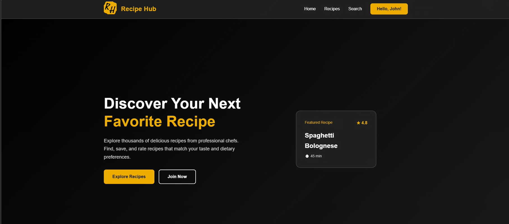

---

### Mobile Homepage

The interface adapts to smaller screens using responsive layouts and a collapsible mobile navigation menu.

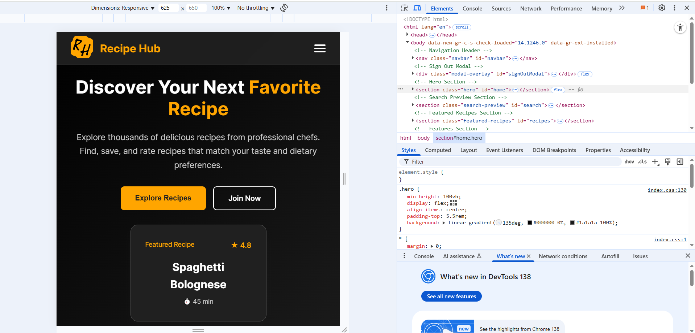

---

### Search and Filtering

Users can search by keyword and filter recipes by category.

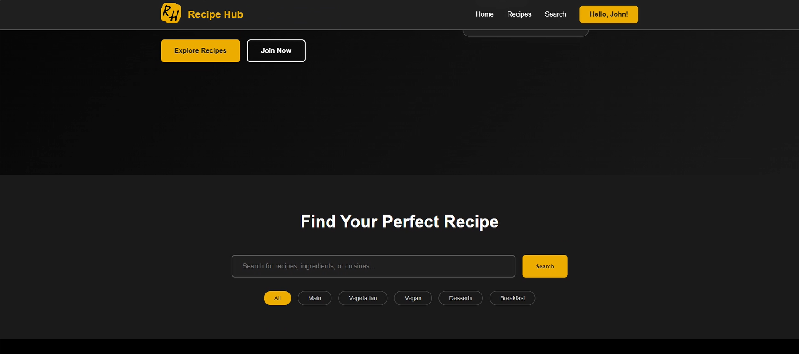

---

### Recipe Rating System

Authenticated users can rate recipes using the interactive star-rating interface.

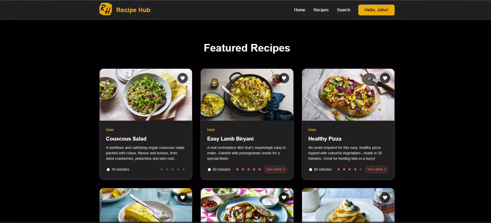

---

### Recipe Details

Recipe details are displayed in a modal containing the recipe description, ingredients, instructions, cooking time, category, and rating.

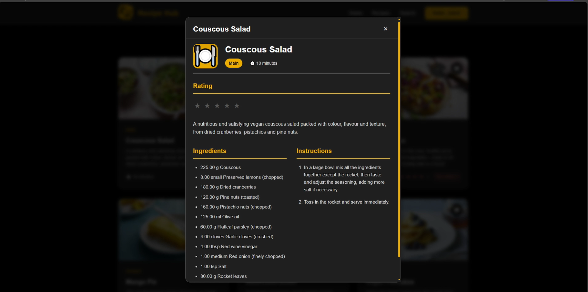

---

### User Registration

New users can create an account and select a dietary preference.

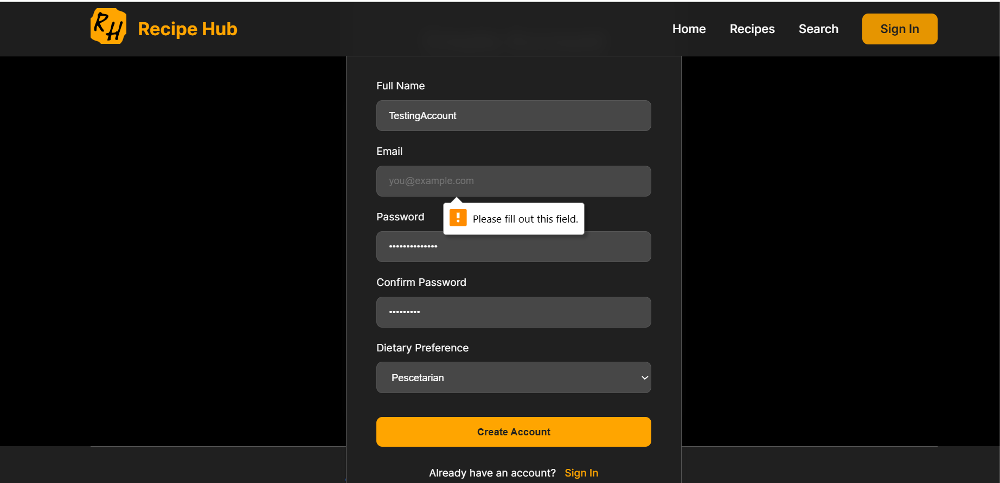

---

### Mobile Sign-In

The authentication interface is fully responsive across mobile and desktop screen sizes.

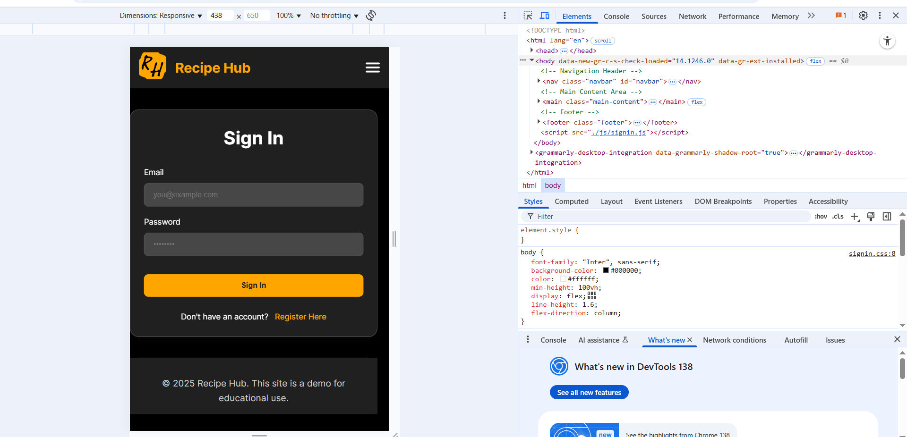

---

### User Profile Dashboard

Users can view their account information, rating total, and saved favourite recipes.

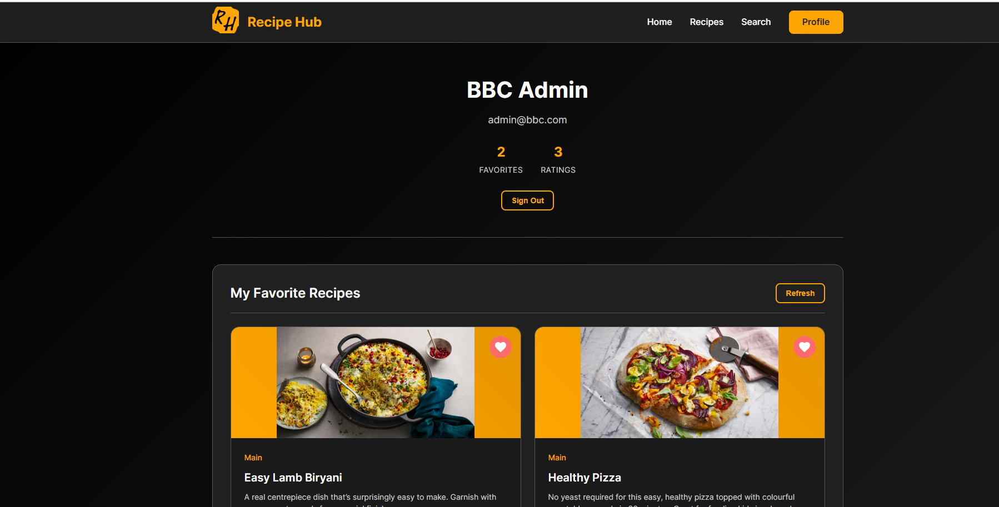

---

### Create Recipe

Authenticated users can access the recipe creation workflow.

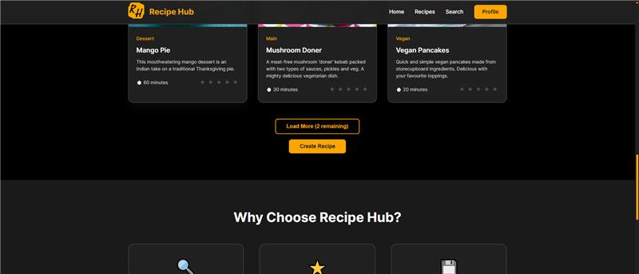

---

### Recipe Creation Form

The recipe form supports recipe details, categories, ingredients, instructions, cooking time, servings, and image uploads.

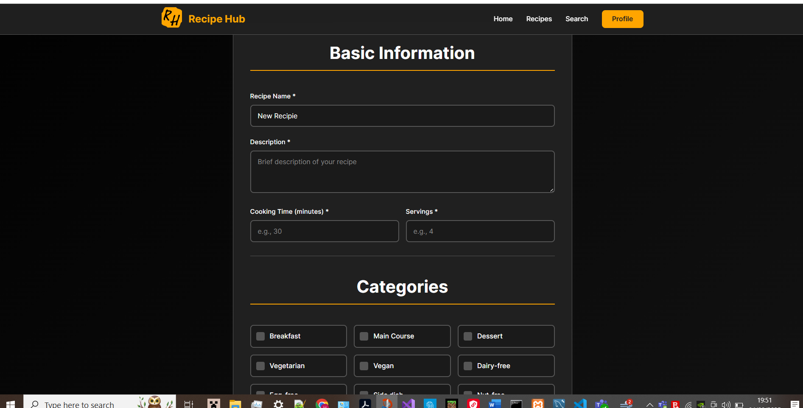

---

### Logout Modal

The application uses confirmation modals for account actions such as signing out.

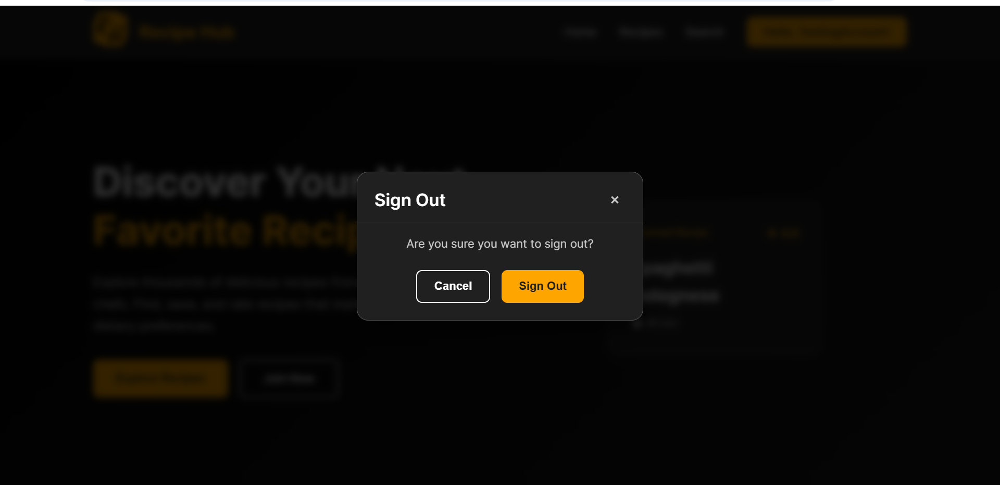

---

## Project Architecture

```text
Frontend
   │
   │ HTTP requests / JSON responses
   ▼
PHP API
   │
   ▼
Controllers
   │
   ▼
Services
   │
   ▼
Models
   │
   ▼
MySQL Database
```

The backend follows an MVC-inspired structure, separating request handling, business logic, and database access.

---

## Project Structure

```text
recipe-hub-full-stack-web-app
│
├── backend/
│   ├── config/
│   ├── controllers/
│   ├── models/
│   ├── public/
│   ├── services/
│   └── views/
│
├── DB/
│   └── recipe-app-EoMA.sql
│
├── frontend/
│
├── images/
│   ├── create-recipe-form.png
│   ├── create-recipe.png
│   ├── hero-homepage.png
│   ├── logout-modal.png
│   ├── mobile-homepage.png
│   ├── profile-dashboard.png
│   ├── rating-system.png
│   ├── recipe-details-modal.png
│   ├── register-page.png
│   ├── search-and-filter.png
│   └── sign-in-mobile.png
│
├── playwright-recipe/
│
├── .gitignore
├── favicon.ico
├── LICENSE
└── README.md
```

---

## Database Design

The MySQL database stores:

- users
- recipes
- ingredients
- recipe steps
- categories
- ratings
- favourites
- dietary preferences

Junction tables are used to manage many-to-many relationships, including recipes assigned to multiple categories and recipes containing multiple ingredients.

Foreign keys maintain referential integrity between related records.

---

## API Endpoints

### Users

| Method | Endpoint | Purpose |
|---|---|---|
| POST | `/users/registration/` | Register a new user |
| POST | `/users/login/` | Authenticate a user |
| POST | `/users/logout/` | End the current session |

### Recipes

| Method | Endpoint | Purpose |
|---|---|---|
| GET | `/recipes/getAll` | Retrieve all recipes |
| GET | `/recipes/getById?id={id}` | Retrieve a recipe by ID |
| GET | `/recipes/getByName?name={name}` | Search recipes by name |
| GET | `/recipes/getFull?id={id}` | Retrieve full recipe details |
| POST | `/recipes/create/` | Create a new recipe |

### Ratings

| Method | Endpoint | Purpose |
|---|---|---|
| POST | `/ratings/rate/` | Submit a recipe rating |
| GET | `/ratings/getByRecipe/?recipe_id={id}` | Retrieve recipe ratings |

### Favourites

| Method | Endpoint | Purpose |
|---|---|---|
| POST | `/favourites/add/` | Save a recipe |
| POST | `/favourites/remove/` | Remove a saved recipe |
| GET | `/favourites/getMy/` | Retrieve the current user's favourites |

---

## Setup

### Requirements

- XAMPP
- MySQL Workbench
- Modern web browser
- Node.js
- Insomnia, optional

### 1. Clone the repository

```bash
git clone https://github.com/egrieving/recipe-hub-full-stack-web-app.git
```

### 2. Move the project into XAMPP

Place the project in:

```text
C:\xampp\htdocs\
```

### 3. Start XAMPP

Start:

- Apache
- MySQL

### 4. Create the database

Create a schema named:

```text
recipe_app_group_a
```

Import:

```text
DB/recipe-app-EoMA.sql
```

### 5. Configure the backend

Create a file named:

```text
backend/.env
```

Use the following format:

```env
DB_HOST=localhost
DB_USER=root
DB_PASS=
DB_NAME=recipe_app_group_a
```

The real `.env` file should remain excluded from Git.

### 6. Launch the application

Open:

```text
http://localhost/frontend
```

---

## Playwright Testing

The project includes Playwright tests written in TypeScript to automate key user journeys.

### Install dependencies

```bash
cd playwright-recipe
npm install
npx playwright install
```

### Run tests

```bash
npx playwright test
```

### Run Chromium tests

```bash
npx playwright test --project=chromium
```

### View the HTML report

```bash
npx playwright show-report
```

---

## My Contribution

This application was developed collaboratively as part of a university group project.

My primary contributions included:

- relational database architecture
- schema design
- technical documentation
- database integration support
- testing and project presentation support

---

## Future Improvements

- password reset functionality
- email verification
- improved account security
- additional recipe filters
- nutrition tracking
- recipe scaling
- recipe comments
- social sharing
- stronger rate limiting
- component-based frontend architecture
- migration to React or Next.js
- CI/CD integration

---

## Educational Use

This project was developed for educational purposes as part of the University of Liverpool MSc Computer Science programme.

Images used within the application remain the property of their respective copyright owners and are included solely for educational and portfolio demonstration purposes.

---

## License

This project is licensed under the MIT License.